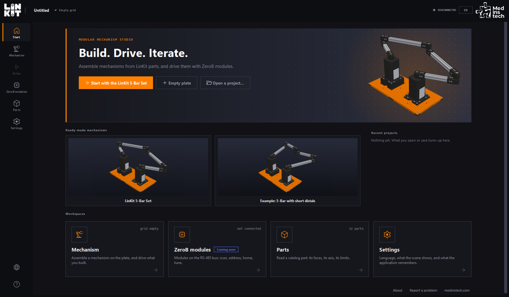
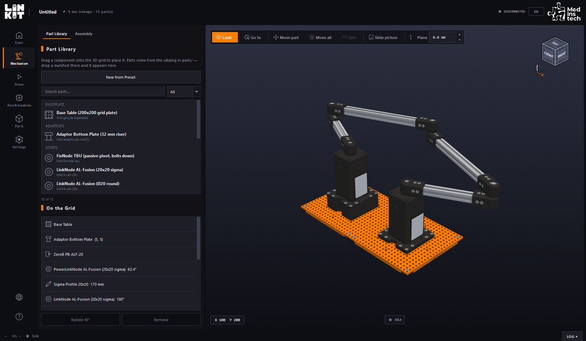
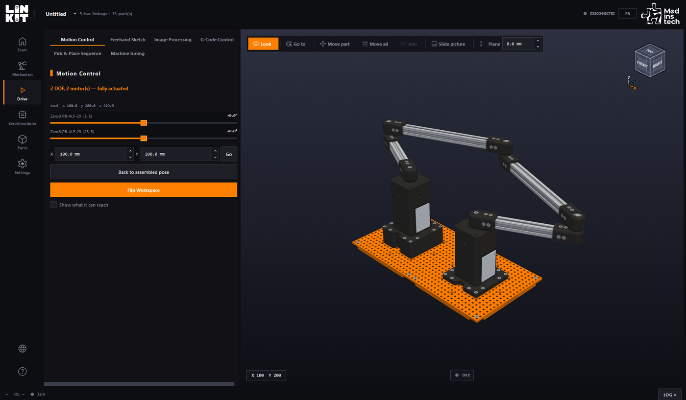
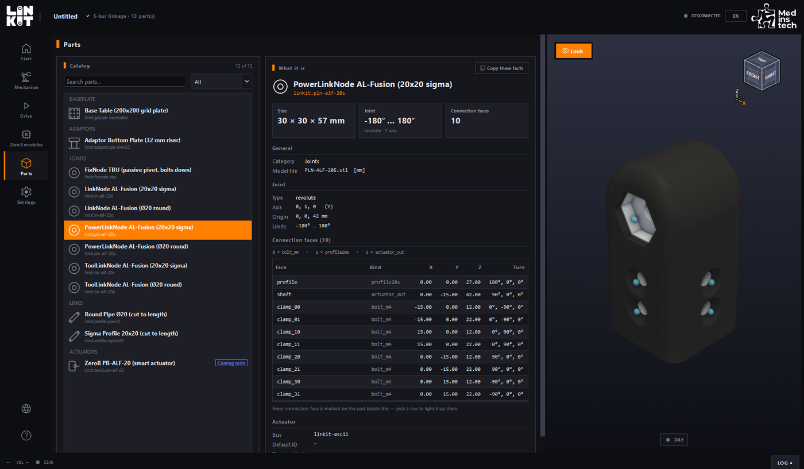

  <picture>
    <source media="(prefers-color-scheme: dark)" srcset=".github/assets/logo-dark.png">
    
  </picture>

<h1 align="center">LinKit Studio</h1>

  <b>Build a mechanism from LinKit parts on screen, then drive the machine you built.</b> 
  LinKit parçalarıyla mekanizmanızı ekranda kurun, sonra kurduğunuz makineyi sürün.

  
  
  
  
  
  

  <a href="https://github.com/medinstech/linkit-studio-releases/releases/latest"><b>⬇&nbsp;&nbsp;Download for Windows, macOS and Linux</b></a>
  &nbsp;·&nbsp; <a href="#english">English</a>
  &nbsp;·&nbsp; <a href="#türkçe">Türkçe</a>
  &nbsp;·&nbsp; <a href="https://www.medinstech.com/linkit/">medinstech.com/linkit</a>

  

<table>
  <tr>
    <td width="33%"></td>
    <td width="33%"></td>
    <td width="33%"></td>
  </tr>
  <tr>
    <td align="center"><b>Build</b> · Kur</td>
    <td align="center"><b>Drive</b> · Sür</td>
    <td align="center"><b>Parts</b> · Parçalar</td>
  </tr>
</table>

---

## 🌎 English

**LinKit Studio** is a free application from Medinstech, for Windows, macOS
and Linux: a sandbox for
building mechanisms from LinKit modules on a grid baseplate, and the control
application for the machines you build with it.

### What you can do with it

- **Build in 3D.** Drag LinKit parts onto the grid baseplate. The application
  recognises what you have assembled, and keeps a build list of the parts
  and bolts it takes.
- **Start from a set.** Open the LinKit 5-Bar Set in one click, or an example,
  and change it from there.
- **Drive it.** A slider for each motor, an X/Y target, and the area the
  mechanism can reach. On a five-bar: freehand sketching, G-code, and pick &
  place.
- **Read every part.** Its size, the range of its joint, and every face
  another part can connect to.
- **In English or Turkish,** one click apart.

No hardware is needed to build and try a mechanism on screen. Driving a real
machine needs one connected over USB or Wi-Fi.

### Download and install

**Windows**

1. Open the **[latest version](https://github.com/medinstech/linkit-studio-releases/releases/latest)**
   and download `LinKit_Studio_Setup_<version>.exe`.
2. Run it, and choose English or Turkish. It installs for your user account
   only, so it needs no administrator rights.
3. If Windows SmartScreen stops it, see [Signed by Medinstech](#signed-by-medinstech).

**macOS**

1. Open the **[latest version](https://github.com/medinstech/linkit-studio-releases/releases/latest)**
   and download `LinKit_Studio_<version>.dmg`.
2. Open it, and drag **LinKit Studio** onto **Applications**.
3. Open LinKit Studio from Applications. The first time, macOS asks whether to
   open an application downloaded from the internet: choose *Open*.

**Linux**

1. Open the **[latest version](https://github.com/medinstech/linkit-studio-releases/releases/latest)**
   and download `LinKit_Studio_<version>_x86_64.AppImage`.
2. Make it executable and open it: `chmod +x LinKit_Studio_<version>_x86_64.AppImage`,
   then double-click it or run it. Nothing is installed, and no administrator
   rights are needed.
3. To check the file is the one published, download the `.sha256` beside it and
   run `sha256sum -c LinKit_Studio_<version>_x86_64.AppImage.sha256`.
4. To drive a real machine over USB, your user must be in the `dialout` group.

**Requirements:** Windows 10 or 11, 64-bit, with about 650 MB of disk space
and a graphics driver with OpenGL 3.2 or later, which any recent computer has.
Or a Mac with Apple Silicon (M1 or later) and macOS 13 or later, with about
900 MB of disk space; Intel Macs are not supported. Or a 64-bit (x86_64) Linux
desktop, Ubuntu 22.04, Debian 12 or later, with about 300 MB for the AppImage.

It installs to `%LOCALAPPDATA%\Programs\Medinstech\LinKit Studio`. To remove
it, use Windows *Settings → Apps*. Your own parts library, in
`%LOCALAPPDATA%\Medinstech\LinkitSandbox`, is left in place. On a Mac it is
`/Applications/LinKit Studio.app`, removed by moving it to the Bin; your parts
library, in `~/Library/Application Support/Medinstech/LinkitSandbox`, stays.
On Linux the AppImage is the whole application: delete the file to remove it.
Your parts library is in `~/.local/share/Medinstech/LinkitSandbox`.

### Updates

A few seconds after it opens, LinKit Studio checks this repository for a newer
version. If there is one, it tells you once, and an **Update** button stays at
the top of the window. Nothing is downloaded until you press it.

- **On Windows, from 2.2.1,** Update downloads the new installer, checks that
  it is signed by Medinstech, asks about any unsaved work, installs it and
  opens LinKit Studio again on the same project and page. If anything goes
  wrong, the version you had comes back.
- **On a Mac and on Linux,** Update downloads the new disk image or AppImage in
  your browser.

The check downloads one small file from GitHub and sends nothing about you or
your projects. It can be turned off in *Settings › Application*.

### Signed by Medinstech

The installer and the application are signed with Medinstech's code-signing
certificate. Windows shows the publisher as *Medinstech Mühendislik ve
Teknoloji Anonim Şirketi*; if it shows anything else, do not run the file.

On a Mac, the application is signed with Medinstech's Developer ID and
notarized by Apple: macOS asks only whether to open an application from the
internet. If it says the application is damaged or cannot be checked for
malicious software, do not open it.

On Linux, each AppImage is published with its SHA-256, in the `.sha256` file
beside it; see *Download and install* for how to check it.

A new release can still meet a Windows SmartScreen warning until enough people
have run it. Choose *More info*, check that the publisher is the one above, and
then *Run anyway*.

### What each release contains

| File | What it is |
|---|---|
| `LinKit_Studio_Setup_<version>.exe` | The installer, for Windows |
| `LinKit_Studio_<version>.dmg` | The disk image, for macOS (from 2.2.0) |
| `LinKit_Studio_<version>_x86_64.AppImage` | The application, for Linux (from 2.2.1) |
| `LinKit_Studio_<version>_x86_64.AppImage.sha256` | Its SHA-256, to check the download with |
| `LICENSE.txt`, `LICENSE.tr.txt` | The licence agreement for that version, in English and Turkish (the installer shows it in the language you choose) |
| `THIRD-PARTY-LICENSES.md` | The open-source components inside the application, and what their licences entitle you to |
| `THIRD-PARTY-NOTICES.txt` | The full licence text of every open-source component inside the application |
| `build-manifest.txt` | The exact library versions that build was made from |
| `latest.json` | What the application reads to learn that a newer version exists |

### Reporting a problem

Use **Report a problem** in the application (on the start page, or in
*Settings › Application*): it opens a form here with the version and your
system already filled in. You can also
[open one directly](https://github.com/medinstech/linkit-studio-releases/issues/new/choose).
Reports need a GitHub account.

### Licence

Free to use, including commercially, on any number of your own devices. The
full terms are in `LICENSE.txt` in each release, and in Turkish in
`LICENSE.tr.txt`.

The application contains third-party components under their own licences —
among them Qt, via PySide6, under the LGPL v3. `THIRD-PARTY-LICENSES.md`
explains what that entitles you to and how to obtain those sources.

### Safety

LinKit Studio commands physical machinery that can move without warning. You are
responsible for operating your hardware safely. Never rely on the software alone
as a safety measure.

---

## 🇹🇷 Türkçe

**LinKit Studio**, Medinstech'in Windows, macOS ve Linux için ücretsiz uygulamasıdır:
LinKit
modülleriyle bir ızgara taban plakası üzerinde mekanizma kurmak için bir
sandbox ve kurduğunuz makineleri kontrol eden uygulama.

### Neler yapabilirsiniz

- **3B olarak kurun.** LinKit parçalarını ızgara taban plakasına sürükleyin.
  Uygulama neyi kurduğunuzu tanır; gereken parçaların ve cıvataların listesini
  de çıkarır.
- **Bir setten başlayın.** LinKit 5-Bar Seti'ni ya da bir örneği tek tıkla
  açın, oradan değiştirin.
- **Sürün.** Her motor için bir kaydırıcı, bir X/Y hedefi ve mekanizmanın
  erişebildiği alan. 5-Bar'da serbest çizim, G-code ve al-bırak.
- **Her parçayı inceleyin.** Ölçüleri, ekleminin aralığı ve başka bir parçanın
  bağlanabileceği her yüzü.
- **Türkçe ya da İngilizce,** aralarında tek tık.

Bir mekanizmayı ekranda kurup denemek için donanım gerekmez. Gerçek bir makineyi
sürmek için USB ya da Wi-Fi ile bağlı bir makine gerekir.

### İndirme ve kurulum

**Windows**

1. **[En son sürümü](https://github.com/medinstech/linkit-studio-releases/releases/latest)**
   açın ve `LinKit_Studio_Setup_<sürüm>.exe` dosyasını indirin.
2. Çalıştırın, Türkçe ya da İngilizce'yi seçin. Yalnızca sizin kullanıcı
   hesabınıza kurulur, yönetici yetkisi gerekmez.
3. Windows SmartScreen durdurursa [Medinstech imzalı](#medinstech-imzalı)
   bölümüne bakın.

**macOS**

1. **[En son sürümü](https://github.com/medinstech/linkit-studio-releases/releases/latest)**
   açın ve `LinKit_Studio_<sürüm>.dmg` dosyasını indirin.
2. Açın ve **LinKit Studio**'yu **Applications** (Uygulamalar) klasörüne
   sürükleyin.
3. LinKit Studio'yu Uygulamalar'dan açın. İlk açılışta macOS, internetten
   indirilmiş bir uygulamayı açmak isteyip istemediğinizi sorar: *Aç*'ı seçin.

**Linux**

1. **[En son sürümü](https://github.com/medinstech/linkit-studio-releases/releases/latest)**
   açın ve `LinKit_Studio_<sürüm>_x86_64.AppImage` dosyasını indirin.
2. Çalıştırılabilir yapıp açın: `chmod +x LinKit_Studio_<sürüm>_x86_64.AppImage`,
   sonra çift tıklayın ya da çalıştırın. Hiçbir şey kurulmaz, yönetici yetkisi
   gerekmez.
3. Dosyanın yayınlanan dosya olduğunu doğrulamak için yanındaki `.sha256`
   dosyasını indirip `sha256sum -c LinKit_Studio_<sürüm>_x86_64.AppImage.sha256`
   komutunu çalıştırın.
4. Gerçek bir makineyi USB ile sürmek için kullanıcınızın `dialout` grubunda
   olması gerekir.

**Gereksinimler:** Windows 10 ya da 11, 64-bit; yaklaşık 650 MB disk alanı ve
OpenGL 3.2 veya üstünü destekleyen bir ekran kartı sürücüsü (yeni her
bilgisayarda vardır). Ya da Apple Silicon işlemcili (M1 ve sonrası), macOS 13
veya üstü bir Mac ve yaklaşık 900 MB disk alanı; Intel işlemcili Mac'ler
desteklenmez. Ya da 64-bit (x86_64) bir Linux masaüstü: Ubuntu 22.04, Debian 12
veya sonrası; AppImage için yaklaşık 300 MB.

Kurulum yeri: `%LOCALAPPDATA%\Programs\Medinstech\LinKit Studio`. Kaldırmak için
Windows *Ayarlar → Uygulamalar*'ı kullanın.
`%LOCALAPPDATA%\Medinstech\LinkitSandbox` altındaki kendi parça kütüphaneniz
silinmez. Mac'te kurulum yeri `/Applications/LinKit Studio.app`; kaldırmak için
Çöp Sepeti'ne taşıyın. `~/Library/Application Support/Medinstech/LinkitSandbox`
altındaki parça kütüphaneniz silinmez. Linux'ta uygulamanın tamamı AppImage
dosyasıdır; kaldırmak için dosyayı silin. Parça kütüphaneniz
`~/.local/share/Medinstech/LinkitSandbox` altındadır.

### Güncellemeler

LinKit Studio açıldıktan birkaç saniye sonra bu depoda daha yeni bir sürüm olup
olmadığına bakar. Varsa bunu bir kez haber verir ve pencerenin üstünde bir
**Güncelleme** düğmesi kalır. Siz basmadan hiçbir şey indirilmez.

- **Windows'ta, 2.2.1'den itibaren,** Güncelle yeni kurulum dosyasını indirir,
  Medinstech imzalı olduğunu doğrular, kaydedilmemiş çalışmanız varsa sorar,
  kurar ve LinKit Studio'yu aynı projede, aynı sayfada yeniden açar. Bir şey
  ters giderse elinizdeki sürüm geri gelir.
- **Mac'te ve Linux'ta** Güncelle, yeni disk görüntüsünü ya da AppImage'ı
  tarayıcınızda indirir.

Kontrol, GitHub'dan küçük bir dosya indirir; sizin veya projeleriniz hakkında
hiçbir bilgi göndermez. *Ayarlar › Uygulama*'dan kapatılabilir.

### Medinstech imzalı

Kurulum dosyası ve uygulama, Medinstech'in kod imzalama sertifikasıyla
imzalıdır. Windows yayıncıyı *Medinstech Mühendislik ve Teknoloji Anonim
Şirketi* olarak gösterir; başka bir şey gösteriyorsa dosyayı çalıştırmayın.

Mac'te uygulama Medinstech'in Developer ID'siyle imzalı ve Apple tarafından
onaylıdır (notarize): macOS yalnızca internetten indirilmiş bir uygulamayı
açmak isteyip istemediğinizi sorar. Uygulamanın hasarlı olduğunu ya da kötü
amaçlı yazılım denetiminin yapılamadığını söylerse açmayın.

Linux'ta her AppImage, yanındaki `.sha256` dosyasındaki SHA-256 özetiyle
yayınlanır; nasıl doğrulanacağı *İndirme ve kurulum* bölümündedir.

Yeni bir sürüm, yeterince kişi çalıştırana kadar yine de Windows SmartScreen
uyarısıyla karşılaşabilir. *Ek bilgi*'yi seçin, yayıncının yukarıdaki olduğunu
kontrol edin, sonra *Yine de çalıştır*'a basın.

### Her sürümde neler var

| Dosya | Ne olduğu |
|---|---|
| `LinKit_Studio_Setup_<sürüm>.exe` | Kurulum dosyası, Windows için |
| `LinKit_Studio_<sürüm>.dmg` | Disk görüntüsü, macOS için (2.2.0'dan itibaren) |
| `LinKit_Studio_<sürüm>_x86_64.AppImage` | Uygulama, Linux için (2.2.1'den itibaren) |
| `LinKit_Studio_<sürüm>_x86_64.AppImage.sha256` | İndirmeyi doğrulamak için SHA-256 özeti |
| `LICENSE.txt`, `LICENSE.tr.txt` | O sürümün lisans sözleşmesi, İngilizce ve Türkçe (kurulum seçtiğiniz dildekini gösterir) |
| `THIRD-PARTY-LICENSES.md` | Uygulamanın içindeki açık kaynak bileşenler ve lisanslarının size tanıdığı haklar |
| `THIRD-PARTY-NOTICES.txt` | Uygulamanın içindeki her açık kaynak bileşenin tam lisans metni |
| `build-manifest.txt` | O derlemenin yapıldığı kütüphane sürümlerinin tam listesi |
| `latest.json` | Uygulamanın yeni sürüm olduğunu öğrenmek için okuduğu dosya |

### Hata bildirimi

Uygulamadaki **Hata bildir** düğmesini kullanın (başlangıç sayfasında veya
*Ayarlar › Uygulama*'da): burada, sürüm ve sistem bilgisi önceden
doldurulmuş bir form açar. Formu
[doğrudan da açabilirsiniz](https://github.com/medinstech/linkit-studio-releases/issues/new/choose).
Bildirim için GitHub hesabı gerekir.

### Lisans

Ticari kullanım dahil, kendi cihazlarınızın tamamında ücretsiz kullanılabilir.
Tam koşullar her sürümdeki `LICENSE.tr.txt` (Türkçe) ve `LICENSE.txt`
(İngilizce) dosyalarındadır.

Uygulama kendi lisanslarına tabi üçüncü taraf bileşenler içerir; bunların
arasında PySide6 üzerinden LGPL v3 lisanslı Qt de var.
`THIRD-PARTY-LICENSES.md` bunun size hangi hakları verdiğini ve kaynak
kodlarına nasıl ulaşacağınızı anlatır.

### Güvenlik

LinKit Studio, uyarı vermeden hareket edebilen fiziksel makineleri kontrol eder.
Donanımınızın güvenli kullanımından siz sorumlusunuz. Güvenlik için hiçbir
zaman yalnızca yazılıma güvenmeyin.

---

  LinKit Studio is made by <a href="https://www.medinstech.com/">Medinstech</a>. · LinKit Studio, <a href="https://www.medinstech.com/">Medinstech</a> tarafından geliştirilmektedir.

